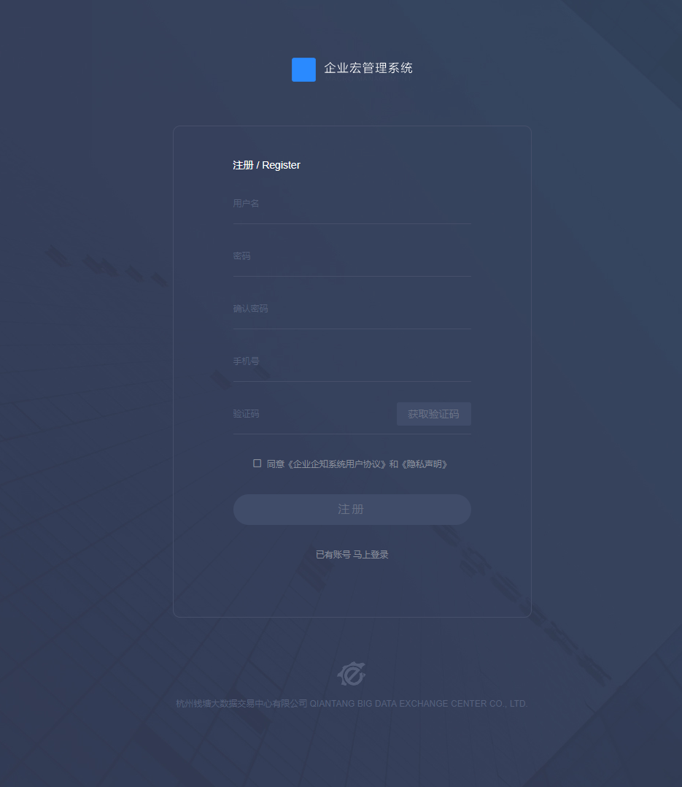

# qt_hong

> A qiantan hong project with vue.js

## 前端技术栈
| 说明 | 备注 | 说明 | 备注 |说明 | 备注 |
|--------|--------|--------|--------|--------|--------|
|  前端框架 |  [vue.js](https://cn.vuejs.org) | 组件库 | [iview](https://www.iviewui.com) | mock 假数据 | [json-server](https://github.com/typicode/json-server) |
| 路由管理 |  [vue-router](https://router.vuejs.org) | 图表插件 | [ECharts](http://echarts.baidu.com) | 表单验证 | [vee-validate](http://vee-validate.logaretm.com)|
| 状态管理 | [vuex](https://vuex.vuejs.org) | AJAX请求 | [axios](https://github.com/axios/axios) | less | [less](http://lesscss.cn) |

## 效果图
| column | column |
|--------|--------|
|   |  |
|  |  |
|  |  |
|  |  |

## Build Setup

``` bash
# install dependencies
npm install

# serve with hot reload at localhost:8080
npm run dev

# run mock
npm run mock

# run mock and dev
npm run devmock

# build for production with minification
npm run build

# build for production and view the bundle analyzer report
npm run build --report
```

For a detailed explanation on how things work, check out the [guide](http://vuejs-templates.github.io/webpack/) and [docs for vue-loader](http://vuejs.github.io/vue-loader).

***

## 总结
>项目做完后学会总结，我觉得这才是做项目的真正意义。
>本项目开发过程中get到了以下几个点：`vee-validate`(表单验证)、`FormData`(上传)、`Promise`、`json-server`(mock模拟假数据)，当然还有用的最多的 `echarts`（图表）。
